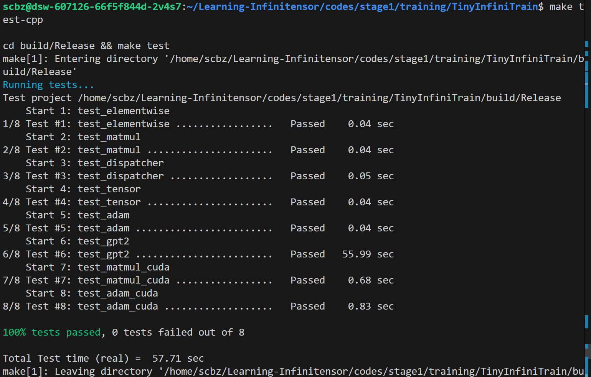
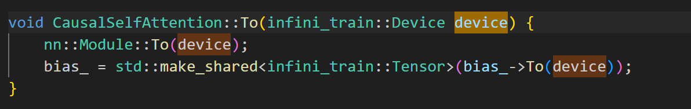

# TinyInfiniTrain 作业报告

## 一、test 通过截图


### 反馈1
Github Action 不能通过, 原因是 TinyInfiniTrain/example/gpt2/net.cc 不支持纯cpu推理, 里面有一段代码没有判断, 直接张量传gpu.

.

看起来也没法修, 因为原版代码的 device.cc 中有设备管理, 能判断是否存在显卡; 简化版省略了这段, 所以没法知道是否存在 gpu.

### 反馈2
建议 .github/workflows/build.yml 中加入

```
    - name: Show test log
      if: failure() || always()
      run: |
        echo "=== LastTest.log ==="
        cat build/Release/Testing/Temporary/LastTest.log || true

    - name: Upload test log artifact
      if: always()
      uses: actions/upload-artifact@v4
      with:
        name: LastTest-log
        path: build/Release/Testing/Temporary/LastTest.log
```

方便查看错误原因和调试.

## 二、作业步骤

> 将代码填入下面代码块中指定位置，并详细描述完成该作业的解决思路和遇到的问题。

### 作业一：autograd机制调用Neg kernel的实现

难度：⭐

对应测例：`TEST(ElementwiseTest, NegForward)`，`TEST(ElementwiseTest, NegBackward)`

需要实现的代码块位置：`infini_train/src/autograd/elementwise.cc`

```c++
std::vector<std::shared_ptr<Tensor>> Neg::Forward(const std::vector<std::shared_ptr<Tensor>> &input_tensors) {
    // =================================== 作业 ===================================
    // TODO：通过Dispatcher获取设备专属kernel，对输入张量进行取反操作
    // HINT: 依赖test_dispatcher，kernel实现已给出
    // =================================== 作业 ===================================
    CHECK_EQ(input_tensors.size(), 1); // 取反操作只需要一个对象
    const auto &input = input_tensors[0];

    auto device = input->GetDevice().Type();
    auto kernel = Dispatcher::Instance().GetKernel({device, "NegForward"});
    return {kernel.Call<std::shared_ptr<Tensor>>(input)};
}

std::vector<std::shared_ptr<Tensor>> Neg::Backward(const std::vector<std::shared_ptr<Tensor>> &grad_outputs) {
    // =================================== 作业 ===================================
    // TODO：通过Dispatcher获取设备专属的反向传播kernel，计算梯度
    // HINT: 依赖test_dispatcher，kernel实现已给出
    // =================================== 作业 ===================================
    CHECK_EQ(grad_outputs.size(), 1);
    const auto &grad_output = grad_outputs[0];

    auto device = grad_output->GetDevice().Type();
    auto kernel = Dispatcher::Instance().GetKernel({device, "NegBackward"});
    return {kernel.Call<std::shared_ptr<Tensor>>(grad_output)};
}
```

#### 解决思路

仿照别的算子写。写的过程中，观察怎么获取device和kernel的。
注意 `Neg` 的反向传播不需要 `grad_output`, 因为 $(-x)' = -1$.  

#### 遇到问题


### 作业二：实现矩阵乘法

难度：⭐⭐

#### CPU实现

对应测例：`TEST(MatmulTest, BasicMatrixMultiply)`，`TEST(MatmulTest, BatchedMatrixMultiply)`, `TEST(MatmulTest, BackwardPass)`

需要实现的代码块位置：`infini_train/src/kernels/cpu/linear.cc`

```c++
    std::shared_ptr<Tensor> MatmulForward(const std::shared_ptr<Tensor> &input, const std::shared_ptr<Tensor> &other) {
        // =================================== 作业 ===================================
        // TODO：实现CPU上的矩阵乘法前向计算
        // REF:
        // =================================== 作业 ===================================
        const auto &input_dims = input->Dims();
        const auto input_dim_size = input_dims.size();
        CHECK_GE(input_dim_size, 2);

        const auto M = input_dims[input_dims.size() - 2];
        const auto K = input_dims[input_dims.size() - 1];

        const auto &other_dims = other->Dims();
        const auto other_dim_size = other_dims.size();
        CHECK_EQ(other_dims.size(), input_dim_size);

        CHECK_EQ(K, other_dims[other_dims.size() - 2]);
        const auto N = other_dims[other_dims.size() - 1];

        auto output_dims = input_dims;
        output_dims.back() = other_dims.back();
        auto output = std::make_shared<Tensor>(output_dims, DataType::kFLOAT32);

        const auto bs = std::accumulate(input_dims.begin(), input_dims.end() - 2, 1LL, std::multiplies<int64_t>{});

        const auto* A_ptr  = static_cast<float*>(input->DataPtr());
        const auto* B_ptr  = static_cast<float*>(other->DataPtr());
        auto* C_ptr = static_cast<float*>(output->DataPtr());

        for (auto b = 0LL; b < bs; b++) {
            Eigen::Map<const Eigen::Matrix<float, Eigen::Dynamic, Eigen::Dynamic, Eigen::RowMajor>> 
                A(A_ptr + b * M * K, M, K);
            Eigen::Map<const Eigen::Matrix<float, Eigen::Dynamic, Eigen::Dynamic, Eigen::RowMajor>> 
                B(B_ptr + b * K * N, K, N);
            Eigen::Map<Eigen::Matrix<float, Eigen::Dynamic, Eigen::Dynamic, Eigen::RowMajor>> 
                C(C_ptr + b * M * N, M, N);

            C.noalias() = A * B; 
        }
        return output;
    }

    std::tuple<std::shared_ptr<Tensor>, std::shared_ptr<Tensor>>
    MatmulBackward(const std::shared_ptr<Tensor> &input, const std::shared_ptr<Tensor> &other,
                const std::shared_ptr<Tensor> &grad_output) {
        // =================================== 作业 ===================================
        // TODO：实现CPU上的矩阵乘法反向传播
        // REF:
        // =================================== 作业 ===================================
        const auto &input_dims = input->Dims();
        const auto input_dim_size = input_dims.size();
        CHECK_GE(input_dim_size, 2);

        const auto M = input_dims[input_dim_size - 2];
        const auto K = input_dims[input_dim_size - 1];

        const auto &other_dims = other->Dims();
        const auto other_dim_size = other_dims.size();
        CHECK_EQ(other_dim_size, input_dim_size);

        CHECK_EQ(K, other_dims[other_dim_size - 2]);
        const auto N = other_dims[other_dim_size - 1];

        const auto &grad_output_dims = grad_output->Dims();
        const auto grad_output_dim_size = grad_output_dims.size();
        CHECK_EQ(M, grad_output_dims[grad_output_dim_size - 2]);
        CHECK_EQ(N, grad_output_dims[grad_output_dim_size - 1]);

        auto grad_input = std::make_shared<Tensor>(input_dims, DataType::kFLOAT32);
        auto grad_other = std::make_shared<Tensor>(other_dims, DataType::kFLOAT32);

        const auto bs = std::accumulate(input_dims.begin(), input_dims.end() - 2, 1LL, std::multiplies<int64_t>{});

        const auto* A_ptr  = static_cast<float*>(input->DataPtr());
        const auto* B_ptr  = static_cast<float*>(other->DataPtr());
        const auto* grad_C_ptr = static_cast<float*>(grad_output->DataPtr());

        auto grad_A_ptr  = static_cast<float*>(grad_input->DataPtr());
        auto grad_B_ptr  = static_cast<float*>(grad_other->DataPtr());

        for (auto b = 0LL; b < bs; b++){
            Eigen::Map<const Eigen::Matrix<float, Eigen::Dynamic, Eigen::Dynamic, Eigen::RowMajor>> 
                A(A_ptr + b * M * K, M, K);
            Eigen::Map<Eigen::Matrix<float, Eigen::Dynamic, Eigen::Dynamic, Eigen::RowMajor>> 
                grad_A(grad_A_ptr + b * M * K, M, K);

            Eigen::Map<const Eigen::Matrix<float, Eigen::Dynamic, Eigen::Dynamic, Eigen::RowMajor>> 
                B(B_ptr + b * K * N, K, N);
            Eigen::Map<Eigen::Matrix<float, Eigen::Dynamic, Eigen::Dynamic, Eigen::RowMajor>> 
                grad_B(grad_B_ptr + b * K * N, K, N);
            
            Eigen::Map<const Eigen::Matrix<float, Eigen::Dynamic, Eigen::Dynamic, Eigen::RowMajor>> 
                grad_C(grad_C_ptr + b * M * N, M, N);

            grad_A.noalias() = grad_C * B.transpose();
            // if other has no batch, grad_other should be accumulately added
            grad_B.noalias() = A.transpose() * grad_C;
        }
        return {grad_input, grad_other};
    }
```

#### CUDA实现

对应测例：`TEST(MatmulTest, BasicMatrixMultiplyCuda)`,`TEST(MatmulTest, BatchedMatrixMultiplyCuda)`,`TEST(MatmulTest, BackwardPassCuda)`

需要实现的代码块位置：`infini_train/src/kernels/cuda/linear.cu`

```c++
std::shared_ptr<Tensor> MatmulForward(const std::shared_ptr<Tensor> &input, const std::shared_ptr<Tensor> &other) {
    // =================================== 作业 ===================================
    // TODO：实现CUDA上的矩阵乘法前向计算
    // REF:
    // =================================== 作业 ===================================
    // Check input is matrices
    // Check input is matrices
    const auto &input_dims = input->Dims();
    const auto input_dim_size = input_dims.size();
    CHECK_GE(input_dim_size, 2);

    const auto M = *(input_dims.rbegin() + 1);
    const auto N = *(input_dims.rbegin());

    // x: ther can be scalar
    // no it cannot
    const auto &other_dims = other->Dims();
    const auto other_dim_size = other_dims.size();
    CHECK_GE(other_dims.size(), 2);

    CHECK_EQ(N, *(other_dims.rbegin() + 1));
    const auto K = *(other_dims.rbegin());

    // suppose no broadcast
    auto output_dims = input_dims;
    output_dims.back() = other_dims.back();
    auto output = std::make_shared<Tensor>(output_dims, DataType::kFLOAT32);

    const auto bs = std::accumulate(input_dims.rbegin() + 2, input_dims.rend(), 1, std::multiplies<int64_t>{});

    const float alpha = 1.0f;
    const float beta = 0.0f;
    cublasHandle_t handle;
    CUBLAS_CHECK(cublasCreate(&handle));

    const float* A = reinterpret_cast<const float *>(input->DataPtr());
    const float* B = reinterpret_cast<const float *>(other->DataPtr());
    float* C = reinterpret_cast<float *>(output->DataPtr());

    // stride
    const long long strideA = M * N;
    const long long strideB = N * K;
    const long long strideC = M * K;

    CUBLAS_CHECK(cublasSgemmStridedBatched(
        handle,
        CUBLAS_OP_N, CUBLAS_OP_N,
        M, K, N,
        &alpha,
        A, M, strideA,
        B, N, strideB,
        &beta,
        C, M, strideC,
        bs));

    CUBLAS_CHECK(cublasDestroy(handle));
    return output;
}

std::tuple<std::shared_ptr<Tensor>, std::shared_ptr<Tensor>>
MatmulBackward(const std::shared_ptr<Tensor> &input, const std::shared_ptr<Tensor> &other,
               const std::shared_ptr<Tensor> &grad_output) {
    // =================================== 作业 ===================================
    // TODO：实现CUDA上的矩阵乘法反向传播
    // REF:
    // =================================== 作业 ===================================
    // Check input is matrices
    const auto &input_dims = input->Dims();
    const auto input_dim_size = input_dims.size();
    CHECK_GE(input_dim_size, 2);

    const auto M = *(input_dims.rbegin() + 1);
    const auto N = *(input_dims.rbegin());

    // suppose no broadcast
    const auto &other_dims = other->Dims();
    const auto other_dim_size = other_dims.size();
    CHECK_GE(other_dims.size(), 2);

    CHECK_EQ(N, *(other_dims.rbegin() + 1));
    const auto K = *(other_dims.rbegin());

    const auto bs = std::accumulate(input_dims.rbegin() + 2, input_dims.rend(), 1, std::multiplies<int64_t>{});

    auto grad_input = std::make_shared<Tensor>(input_dims, DataType::kFLOAT32);
    auto grad_other = std::make_shared<Tensor>(other_dims, DataType::kFLOAT32);

    const float alpha = 1.0f;
    const float beta = 0.0f;
    cublasHandle_t handle;
    CUBLAS_CHECK(cublasCreate(&handle));

    const float* A = reinterpret_cast<const float *>(input->DataPtr());
    const float* B = reinterpret_cast<const float *>(other->DataPtr());
    const float* grad_C = reinterpret_cast<const float *>(grad_output->DataPtr());
    float* grad_A = reinterpret_cast<float *>(grad_input->DataPtr());
    float* grad_B = reinterpret_cast<float *>(grad_other->DataPtr());

    // Strides
    const long long strideA = M * N;
    const long long strideB = N * K;
    const long long strideC = M * K;

    CUBLAS_CHECK(cublasSgemmStridedBatched(
        handle,
        CUBLAS_OP_N, CUBLAS_OP_T,
        M, N, K,
        &alpha,
        grad_C, M, strideC,
        B, N, strideB,
        &beta,
        grad_A, M, strideA,
        bs));
    
    CUBLAS_CHECK(cublasSgemmStridedBatched(
        handle,
        CUBLAS_OP_T, CUBLAS_OP_N,
        N, K, M,
        &alpha,
        A, M, strideA,
        grad_C, M, strideC,
        &beta,
        grad_B, N, strideB,
        bs));

    CUBLAS_CHECK(cublasDestroy(handle));

    return {grad_input, grad_other};
}
```

#### 解决思路
CPU 部分：参考 `LinearForward` 和 `LinerBackward` 的实现写.  
GPU 部分：参考 CPU 写。
想到 cuda 编程说的，不要用 for 循环，在 host 和 GPU 之前传多次。所以借助了 GPT 换成了 batched 版本

CPU 部分, batch size 是要单独拿出来的. `Eigen` 并不支持高维矩阵的直接计算, 因为会折叠成向量, 导致 \[bs1, M, N\] 和 \[bs2, N, K\] 中, N 对不齐. 解决的办法是先 map. 数据指针在 class Tensor 的 cc 文件可以找到定义. 但是最后也不知道怎么找到 `Map`. 最后的解决办法是 GPT. 

cuBlas 的参数很难想明白。

cuBLAS 会先跳着读，相当于先复制一份改变顺序的矩阵，再1比1传给GPU
 （实际当然不需要，只需要换组织方式就行）
所以 (2,3,4) 的矩阵
[[a11, a12, a13, a14
  a21, a22, a23, a24,
  a31, a32, a33, a34],

 [b11, b12, b13, b14
  b21, b22, b23, b24,
  b31, b32, b33, b34]]

内存中应该是
a11, a12, a13, a14, a21, a22, a23, a24, a31, a32, a33, a34, b11, b12, b13, b14 ...

cuBLAS 会复制成
a11, a21, a31, a12, ...

然后重排成
所以 (2,3,4) 的矩阵
[[a11, a21, a31
  a12, a22, a13,
  a13, a23, a33,
  a14, a24, a34],

 [b11, b21, b31
  b12, b22, b13,
  b13, b23, b33,
  b14, b24, b34]]

现在每一行是一个向量了，每个向量中包含3个元素，所以主序是3
对的！主序不是向量的个数，而是向量中包含元素的个数，即向量大小
所以一个矩阵 A (bs, m, n) 如果什么都不做，会被解释成 A^T (bs, n, m)，主序n

总结
永远写成 
op(B^T) * op(A^T) = C^T
B^T [bs, N, K], N
A^T [bs, K, M], K
C^T [bs, N, M], N

GPU 的 cublas 是列优先的。感觉之前学过，矩阵乘法，ikj 顺序比 ijk 的 locality 好很多。估计是这个原因？

#### 遇到问题
建议 testcase 添加判断张量是不是在device上。我一开始 `auto grad_input = std::make_shared<Tensor>(input_dims, DataType::kFLOAT32);` 张量在cpu上，这部分testcase能过，但是GPT2的一直报SEGFAULT，很难排查原因。

### 作业三：实现Adam优化器

难度：⭐

#### CPU实现

对应测例：`TEST(AdamOptimizerTest, BasicParameterUpdate)`,`TEST(AdamOptimizerTest, MomentumAccumulation)`

代码位置：infini_train/src/kernels/cpu/accumulate_grad.cc

```c++
void AdamAccumulateGrad(const std::shared_ptr<Tensor> &grad, const std::shared_ptr<Tensor> &param,
                        const std::shared_ptr<Tensor> &m, const std::shared_ptr<Tensor> &v, float learning_rate,
                        float beta1, float beta2, float eps, int64_t t) {
    // =================================== 作业 ===================================
    // TODO：实现Adam优化器的梯度累积和参数更新
    // REF:
    // =================================== 作业 ===================================
    CHECK(grad != nullptr);
    CHECK(param != nullptr);
    CHECK(m != nullptr);
    CHECK(v != nullptr);

    const size_t n = grad->NumElements();
    CHECK_EQ(param->NumElements(), n);
    CHECK_EQ(m->NumElements(), n);
    CHECK_EQ(v->NumElements(), n);

    CHECK_GT(t, 0) << "Adam step t must be >= 1";

    m->EigenMatrix() = beta1 * m->EigenMatrix() + (1-beta1) * grad->EigenMatrix();
    v->EigenMatrix() = beta2 * v->EigenMatrix() + (1-beta2) * grad->EigenMatrix().array().square().matrix(); // x: grad->E * grad->E

    auto m_hat = m->EigenMatrix().array() / (1.0f - powf(beta1, t));
    auto v_hat = v->EigenMatrix().array() / (1.0f - powf(beta2, t));
    param->EigenMatrix().array() -= learning_rate * m_hat / (v_hat.sqrt() + eps);
}
```

#### CUDA实现

对应测例：`TEST(AdamOptimizerTest, BasicParameterUpdateCuda)`,`TEST(AdamOptimizerTest, MomentumAccumulationCuda)`

代码位置：infini_train/src/kernels/cuda/accumulate_grad.cu

```c++
__global__ void AdamAccumulateGradKernel(float* param_ptr,
                                        float* m_ptr,
                                        float* v_ptr,
                                        const float* grad_ptr,
                                        const float beta1,
                                        const float beta2,
                                        const float bias_correction1,
                                        const float bias_correction2,
                                        const float learning_rate,
                                        const float eps,
                                        const size_t num_elements) {
    size_t idx = blockIdx.x * blockDim.x + threadIdx.x;
    if (idx < num_elements) {
        float m_t = beta1 * m_ptr[idx] + (1 - beta1) * grad_ptr[idx];
        float v_t = beta2 * v_ptr[idx] + (1 - beta2) * grad_ptr[idx] * grad_ptr[idx];
        
        // 要写回m&v！
        m_ptr[idx] = m_t;
        v_ptr[idx] = v_t;
        
        float m_hat = m_t / bias_correction1;
        float v_hat = v_t / bias_correction2;
        param_ptr[idx] -= learning_rate * m_hat / (sqrtf(v_hat) + eps);
    }
}

void AdamAccumulateGrad(const std::shared_ptr<Tensor> &grad, const std::shared_ptr<Tensor> &param,
                        const std::shared_ptr<Tensor> &m, const std::shared_ptr<Tensor> &v, float learning_rate,
                        float beta1, float beta2, float eps, int64_t t) {
    // =================================== 作业 ===================================
    // TODO：实现Adam优化器的梯度累积和参数更新
    // REF:
    // =================================== 作业 ===================================
    CHECK(grad != nullptr);
    CHECK(param != nullptr);
    CHECK(m != nullptr);
    CHECK(v != nullptr);

    const size_t n = grad->NumElements();
    CHECK_EQ(param->NumElements(), n);
    CHECK_EQ(m->NumElements(), n);
    CHECK_EQ(v->NumElements(), n);

    CHECK_GT(t, 0) << "Adam step t must be >= 1";

    const float bias_correction1 = 1.0f - powf(beta1, t);
    const float bias_correction2 = 1.0f - powf(beta2, t);
    
    int threads_per_block = 256;
    int num_blocks = (n + threads_per_block - 1) / threads_per_block;

    AdamAccumulateGradKernel<<<num_blocks, threads_per_block>>> (
        static_cast<float *>(param->DataPtr()),
        static_cast<float *>(m->DataPtr()),
        static_cast<float *>(v->DataPtr()),
        static_cast<float *>(grad->DataPtr()),
        beta1,
        beta2,
        bias_correction1,
        bias_correction2,
        learning_rate,
        eps,
        n
    );
}
```

#### 解决思路
查阅资料之后发现，Adam 是逐元素计算的，所以cuda不涉及数据同步的问题。
这里一直报错，因为张量m，v没更新。因为读函数的参数签名的时候，误以为m, v是只读的，以为不需要更新。后面发现是共享指针只读。

#### 遇到问题

### 作业四：实现Tensor基础操作

#### 实现Tensor的Flatten操作

难度：⭐

对应测例：`TEST(TensorTransformTest, Flatten2DTo1D)`,`TEST(TensorTransformTest, FlattenWithRange) `,`TEST(TensorTransformTest, FlattenNonContiguous)`

代码位置：infini_train/src/tensor.cc

```c++
std::shared_ptr<Tensor> Tensor::Flatten(int64_t start, int64_t end) {
    // return Contiguous()->View(new_shape);
    // =================================== 作业 ===================================
    // TODO：实现张量扁平化操作，将指定维度范围[start, end]内的所有维度合并为一个维度
    // HINT:
    // =================================== 作业 ===================================

    // support neg dim
    if (start < 0) {
        start += dims_.size();
    }

    if (end < 0) {
        end += dims_.size();
    }

    CHECK_GE(start, 0);
    CHECK_GE(end, start);
    CHECK_LT(end, dims_.size());
    
    const auto flattened_dim = std::accumulate(dims_.begin() + start, dims_.begin() + end + 1, (int64_t){1}, std::multiplies<int64_t>{});

    auto new_shape = dims_;
    new_shape.erase(new_shape.begin() + start, new_shape.begin() + end + 1);
    new_shape.insert(new_shape.begin() + start, flattened_dim);  

    return Contiguous()->View(new_shape);
}
```

#### 实现Tensor的反向传播机制

难度：⭐

对应测例：`TEST(TensorAutogradTest, BackwardComputesGradient)`,`TEST(TensorAutogradTest, BackwardWithMultipleOutputs)`

代码位置：infini_train/src/tensor.cc

```c++
void Tensor::Backward(std::shared_ptr<Tensor> gradient, bool retain_graph, bool create_graph) const {
    // =================================== 作业 ===================================
    // TODO：实现自动微分反向传播
    // 功能描述：1. 计算当前张量对叶子节点的梯度    2. 支持多输出场景的梯度累加
    // =================================== 作业 ===================================
    CHECK(requires_grad_);
    if (grad_fn_) {
        if (!gradient) {
            gradient = std::make_shared<Tensor>(dims_, dtype_, GetDevice());
            gradient->Fill<float>(1.0f);
        }
        grad_fn()->BackwardPartial(gradient, output_idx_);
    }
}
```

#### 解决思路
第一个明显不涉及数据，只是组织变一下。参数的类型非常有意思，明显是故意支持负值。然后看到上面有个函数使用了 `Contiguous()->View(new_shape)`，然后查了一下知道这是啥意思就好做了。
第二个发现叶子节点的建立AccumulateGrad类的过程也在BackwardPartial里面了，所以直接检查要不要梯度，如果要但是没有，就填一个张量出来。

#### 遇到问题
有个问题是，反向传播如果用nn::Ones构造张量，会不过testcase，有点没懂为啥。


### 作业五 注册算子kernel的实现

难度：⭐⭐⭐

对应测例：`TEST(DispatcherTest, RegisterAndGetKernel)`,`TEST(DispatcherTest, DuplicateRegistration)`,`TEST(DispatcherTest, GetNonexistentKernel)`

代码位置：infini_train/include/dispatcher.h

```c++
template <typename RetT, class... ArgsT> RetT Call(ArgsT... args) const {
    // =================================== 作业 ===================================
    // TODO：实现通用kernel调用接口
    // 功能描述：将存储的函数指针转换为指定类型并调用
    // =================================== 作业 ===================================

    using FuncT = RetT (*)(ArgsT...);
    // TODO: 实现函数调用逻辑

    FuncT func = reinterpret_cast<FuncT>(func_ptr_);
    return func(std::forward<ArgsT>(args)...);
}

template <typename FuncT> void Register(const KeyT &key, FuncT &&kernel) {
    // =================================== 作业 ===================================
    // TODO：实现kernel注册机制
    // 功能描述：将kernel函数与设备类型、名称绑定
    // =================================== 作业 ===================================
    CHECK(!key_to_kernel_map_.contains(key)) 
        << "Kernel already registered: " << key.second;
    key_to_kernel_map_.emplace(key, KernelFunction(kernel));
}

#define REGISTER_KERNEL(device, kernel_name, kernel_func)                                                              \
    static bool registery_##kernel_name##_##__LINE__ = []() {                                                            \
        infini_train::Dispatcher::Instance().Register({device, #kernel_name}, kernel_func);                          \
        return true;                                                                                                   \
    }();
    // =================================== 作业 ===================================
    // TODO：实现自动注册宏
    // 功能描述：在全局静态区注册kernel，避免显式初始化代码
    // =================================== 作业 ===================================
```

#### 解决思路
1. 我原本是直接 `return` 做的，能过test。然后后面两个不会做，就去看了原版 InfiniTrain 项目，发现有这个函数，然后 GPT 一下说更安全，就换成这样了。  
2. 注册很容易。为什么要判重没理解  
3. 根本不知道怎么注册宏。。。去看了原版的 InfiniTrain 项目，Register 是 bool 类型的，直接 static 定义静态变量就行了。这里 void 没有返回值，想不到怎么做。还是 GPT。（lambda函数，拼接变量名，字符串化操作，啥的都是在这里新学的）  

还有个有意思的地方是，宏内部不能单行注释，原理是: `\` 会拼接行，所以后面一行会进注释。

#### 遇到问题
注册的时候  
1. 逻辑上：为啥要看是不是已经存在 key 了？如果重复直接替换好像感觉也不错？
2. 实现上：不加判重，test 会报错。但是具体为什么？


### 作业六：实现GPT-2整体训练

难度：⭐⭐⭐⭐

对应测例：`TEST_F(GPT2TrainingTest, LogitsConsistency)`

#### 训练过程logits对比

完成以上所有作业，补齐训练框架的所有实现，理论上`TEST_F(GPT2TrainingTest, LogitsConsistency)`可以通过，在用例中判断比较预置的值和单步正向传播计算结果是否在误差允许范围内相等。

#### 数据读取实现

代码位置：example/common/tiny_shakespeare_dataset.cc

```c++
TinyShakespeareFile ReadTinyShakespeareFile(const std::string &path, size_t sequence_length) {
    /* =================================== 作业 ===================================
       TODO：实现二进制数据集文件解析
       文件格式说明：
    ----------------------------------------------------------------------------------
    | HEADER (1024 bytes)                     | DATA (tokens)                        |
    | magic(4B) | version(4B) | num_toks(4B) | reserved(1012B) | token数据           |
    ----------------------------------------------------------------------------------
       =================================== 作业 =================================== */
    std::ifstream fin(path, std::ios::binary);
    CHECK(fin) << "Failed to open file" << path;

    TinyShakespeareFile text_file;
    const auto header = ReadSeveralBytesFromIfstream(1024, &fin);
    const int32_t magic = BytesToType<int32_t>(header, 0); // sec param is offset from beginning
    const int32_t version = BytesToType<int32_t>(header, 4);
    const int32_t num_tokens = BytesToType<int32_t>(header, 8);
    text_file.type = kTypeMap.at(magic);

    const int num_sequences = num_tokens / sequence_length;
    text_file.dims.assign({num_sequences, static_cast<int64_t>(sequence_length)});

    const int data_size_in_bytes
        = std::accumulate(text_file.dims.begin(),
                        text_file.dims.end(),
                        kTypeToSize.at(text_file.type),
                        std::multiplies<int>{} // use {} instead
          );
    text_file.tensor = infini_train::Tensor(text_file.dims, DataType::kINT64);
    int64_t *dst = static_cast<int64_t *>(text_file.tensor.DataPtr());

    // 感觉上面很复杂。。。 明明都 if 了， 不如直接 cast
    if (text_file.type == TinyShakespeareType::kUINT16) {
        CHECK_LE(sequence_length, 1024); // GPT-2: max_seq_length = 1024
        std::vector<uint16_t> vec(num_sequences * sequence_length);
        fin.read(reinterpret_cast<char *>(vec.data()), data_size_in_bytes);
        for (size_t i = 0; i < vec.size(); ++i) { dst[i] = static_cast<int64_t>(vec[i]); }
    } else if (text_file.type == TinyShakespeareType::kUINT32) {
        CHECK_LE(sequence_length, 8192); // LLaMA-3: max_seq_length = 8192
        std::vector<int32_t> vec(num_sequences * sequence_length);
        fin.read(reinterpret_cast<char *>(vec.data()), data_size_in_bytes);
        for (size_t i = 0; i < vec.size(); ++i) { dst[i] = static_cast<int64_t>(vec[i]); }
    }
    return text_file;
}
```

```c++
TinyShakespeareDataset::TinyShakespeareDataset(const std::string &filepath, size_t sequence_length)
    : text_file_(ReadTinyShakespeareFile(filepath, sequence_length)), sequence_length_(sequence_length),
      sequence_size_in_bytes_(sequence_length * sizeof(int64_t)), num_samples_(text_file_.dims[0] - 1) {
    CHECK_EQ(text_file_.dims[1], sequence_length_);
    CHECK_EQ(static_cast<int>(text_file_.tensor.Dtype()), static_cast<int>(DataType::kINT64));
}
```

#### Tokenizer功能实现

代码位置：example/common/tokenizer.cc

```c++
Tokenizer::Tokenizer(const std::string &filepath) {
    /* ===================================== 作业 =====================================
    TODO：实现Tokenizer二进制文件加载

    文件格式说明：
    ----------------------------------------------------------------------------------
    | HEADER (1024 bytes)                     | VOCAB TABLE                           |
    | magic(4B) | version(4B) | vocab_size(4B) | reserved(1012B) | token词表数据       |
    ----------------------------------------------------------------------------------
    ===================================== 作业 ===================================== */
    std::cout << "Tokenizer Start" << std::endl;

    std::ifstream fin(filepath, std::ios::binary);
    CHECK(fin) << "Failed to open file" << filepath;

    const auto header = ReadSeveralBytesFromIfstream(1024, &fin);
    magic_number_ = BytesToType<uint32_t>(header, 0);
    const uint32_t version = BytesToType<uint32_t>(header, 4);
    vocab_size_ = BytesToType<uint32_t>(header, 8);
    eot_token_ = kEotMap.at(magic_number_);
    
    for (uint32_t i = 0; i < vocab_size_; i++) {
        auto curSizeByte = ReadSeveralBytesFromIfstream(1, &fin);
        auto curSize = BytesToType<uint8_t>(curSizeByte, 0);
        auto tokenByte = ReadSeveralBytesFromIfstream(curSize, &fin);
        // memcpy 不能作用于变长类型
        // std::string token = BytesToType<std::string>(tokenByte, 0);
        std::string token(tokenByte.begin(), tokenByte.end());
        token_table_.push_back(token);
    }
    std::cout << "Tokenizer End" << std::endl;
}
```

```c++
std::string Tokenizer::Decode(uint32_t token_id) const {
    /* ===================================== 作业 =====================================
    TODO：实现token_id到文本的转换
    功能描述：根据token_id返回对应的文本片段
    ===================================== 作业 ===================================== */
    std::cout << "Decode Start" << std::endl;
    CHECK_LT(token_id, token_table_.size()) << "Too much tokens";
    std::cout << "Decode End" << std::endl;
    return token_table_[token_id];
}
```

```c++
void Tokenizer::GenerateText(infini_train::nn::Module &model, uint32_t batch_size, uint32_t sequence_length,
                             uint32_t text_length, Device device) const {
    std::vector<int64_t> dims;
    dims.assign({batch_size, sequence_length});
    // x_tensor (FLAGS_batch_size, FLAGS_sequence_length) eq:(4, 64)
    infini_train::Tensor x_tensor = infini_train::Tensor(dims, DataType::kINT64);
    int64_t *x_buff = static_cast<int64_t *>(x_tensor.DataPtr());
    for (int i = 0; i < batch_size * sequence_length; ++i) { x_buff[i] = eot_token_; }

    // Give some contexts: "The meaning of life is "
    auto prompt = kPromptMap.at(magic_number_);
    auto prompt_len = prompt.size();
    for (int i = 0; i < prompt_len; ++i) { x_buff[i] = prompt[i]; }
    std::cout << "The meaning of life is";

    auto x = std::make_shared<infini_train::Tensor>(x_tensor.To(device));
    uint64_t kRngState = kRngState;
    LOG(INFO) << "start generate text:";
    // set cpu device
    const auto cpu_device = Device{};
    for (int t = prompt_len; t < text_length; t++) {
        /* ===================================== 作业 =====================================
        TODO：实现单步文本生成逻辑
        HINT：调用model.Forward推理获取logits，根据推理结果进行随机采样，调用Decode获取文本结果
        ===================================== 作业 ===================================== */
        x = std::make_shared<infini_train::Tensor>(x->To(device));

        auto logits_device = model.Forward({x})[0];
        auto logits_device_norm = nn::function::Softmax(logits_device, -1);
        auto logits_cpu_norm  = logits_device_norm->To(cpu_device);

        auto data_cpu = logits_cpu_norm.DataPtr();
        auto probs_cpu = static_cast<float *>(data_cpu) + (t - 1) * vocab_size_;

        x = std::make_shared<infini_train::Tensor>(x->To(cpu_device));
        auto x_data_cpu = static_cast<int64_t *>(x->DataPtr());
        auto next_token = SampleMult(probs_cpu, vocab_size_, RandomF32(kRngState));
        x_data_cpu[t] = next_token;
        std::cout << Decode(next_token) << " ";
    }
    std::cout << std::endl;
}
```

#### 解决思路
##### Dataset
一开始做作业的时候没看到头文件的注释 `https://github.com/karpathy/llm.c/blob/master/dev/data/tinyshakespeare.py`，完全看不懂应该怎么实现。GPT说这个也不是标准格式。所以只能去找 InfiniTrain 原项目。头文件的字段，哪个有用哪个没用，magic 字段对应 GPT-2 或者 LLaMA 3 是真想不到。。。我一开始以为头全都丢，然后使用的时候自行调用，类似于传命令行参数来决定用什么模型。

所以 dataset 基本就是抄完了，然后读懂了。

##### Tokenizer
Tokenizer 的部分更混乱。。。首先有了上面的dataset的经验，而且class里有成员，所以头怎么读是比较清楚的。

但是词表格式不知道怎么看。  

```shell
$ ls -R Data/
Data/:
gpt2_124M.bin  gpt2_124M_bf16.bin  gpt2_124M_debug_state.bin  gpt2_logits_reference.bin  gpt2_tokenizer.bin  tinyshakespeare

Data/tinyshakespeare:
tiny_shakespeare_train.bin  tiny_shakespeare_val.bin
```

借助gpt，先搞明白文件目录。需要的文件是  
1. gpt2_logits_reference.bin：gpt的词表  
2. tiny_shakespeare_train.bin：之前dataset函数需要的整数二进制文件  

所以 dataset 是里有整数序列，可以直接读，但是词表格式没法知道。这时候`xxd`一下：

```xxd
00000400: 0121 0122 0123 0124 0125 0126 0127 0128  .!.".#.$.%.&.'.(
00000410: 0129 012a 012b 012c 012d 012e 012f 0130  .).*.+.,.-.../.0
00000420: 0131 0132 0133 0134 0135 0136 0137 0138  .1.2.3.4.5.6.7.8
00000430: 0139 013a 013b 013c 013d 013e 013f 0140  .9.:.;.<.=.>.?.@
00000440: 0141 0142 0143 0144 0145 0146 0147 0148  .A.B.C.D.E.F.G.H
00000450: 0149 014a 014b 014c 014d 014e 014f 0150  .I.J.K.L.M.N.O.P
00000460: 0151 0152 0153 0154 0155 0156 0157 0158  .Q.R.S.T.U.V.W.X
00000470: 0159 015a 015b 015c 015d 015e 015f 0160  .Y.Z.[.\.].^._.`
00000480: 0161 0162 0163 0164 0165 0166 0167 0168  .a.b.c.d.e.f.g.h
00000490: 0169 016a 016b 016c 016d 016e 016f 0170  .i.j.k.l.m.n.o.p
000004a0: 0171 0172 0173 0174 0175 0176 0177 0178  .q.r.s.t.u.v.w.x
000004b0: 0179 017a 017b 017c 017d 017e 01a1 01a2  .y.z.{.|.}.~....
...
00000600: 0220 7402 2061 0268 6502 696e 0272 6502  . t. a.he.in.re.
00000610: 6f6e 0420 7468 6502 6572 0220 7302 6174  on. the.er. s.at
00000620: 0220 7702 206f 0265 6e02 2063 0269 7402  . w. o.en. c.it.
00000630: 6973 0261 6e02 6f72 0265 7302 2062 0265  is.an.or.es. b.e
00000640: 6402 2066 0369 6e67 0220 7002 6f75 0320  d. f.ing. p.ou. 
00000650: 616e 0261 6c02 6172 0320 746f 0220 6d03  an.al.ar. to. m.
00000660: 206f 6603 2069 6e02 2064 0220 6804 2061   of. in. d. h. a
00000670: 6e64 0269 6302 6173 026c 6503 2074 6803  nd.ic.as.le. th.
```

借助 GPT，词表格式有定长和变长，这里很明显的是，`0x400` 附近像是符号和字母表，字母之间的间隔不多，`0x600` 附近开始像是有词了，但是看起来有offset。这是后就挺明确是变长的了。借助GPT，`0x400` 开始 `0121` 一个字节的长度，`21` 确实对应`!`。所以读序列的时候，读一个 `kUINT16` 的长度，这是一个词的长度，然后按照值读string并cast存类里面就好了。

实现的时候怎么在设备里传来传去包括 softmax 没有在forword中直接给出之类的，都有点想不到，参考原版一点点写的。
